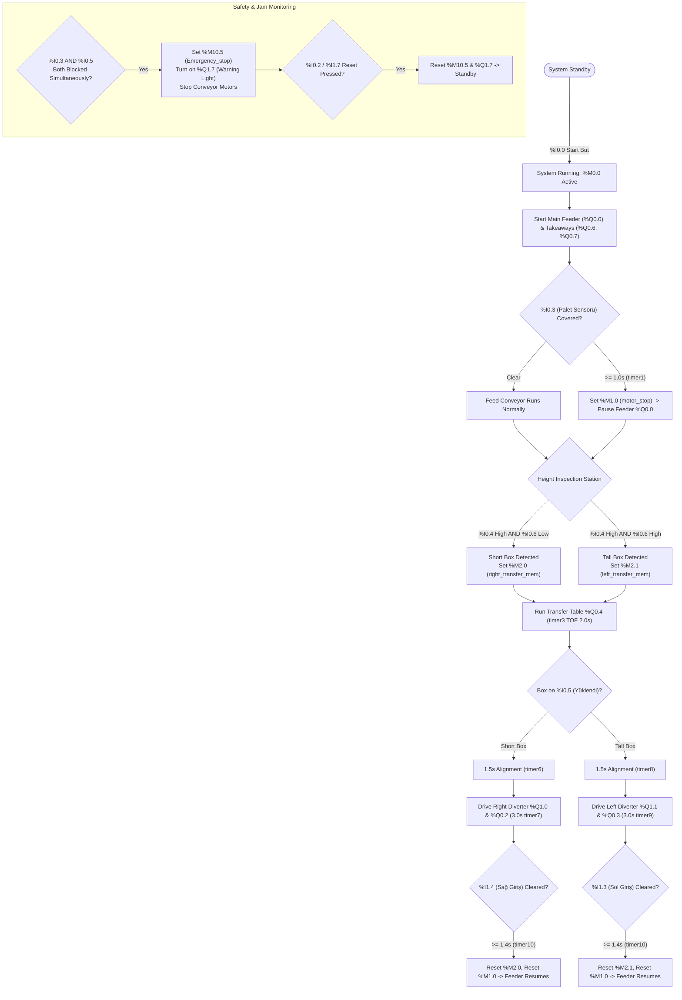
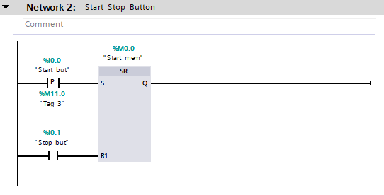
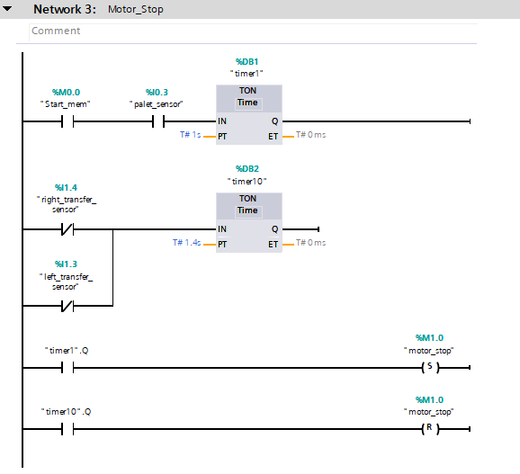
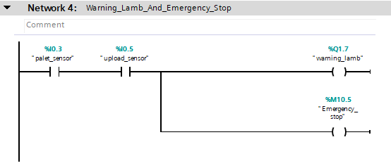
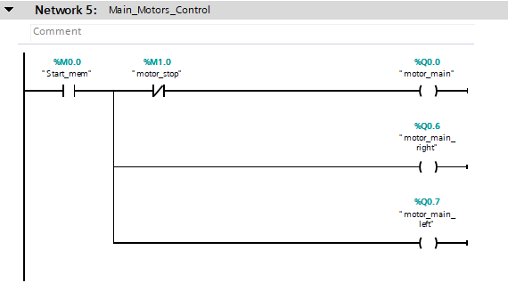
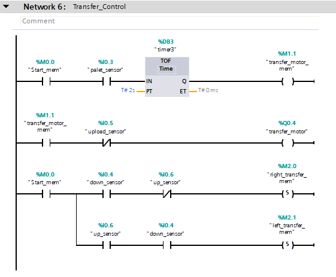
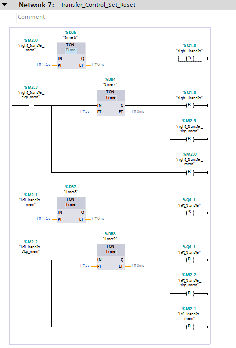
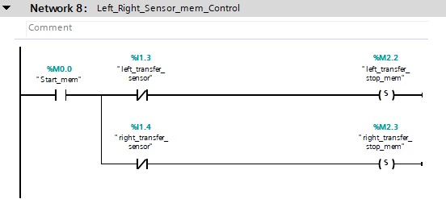
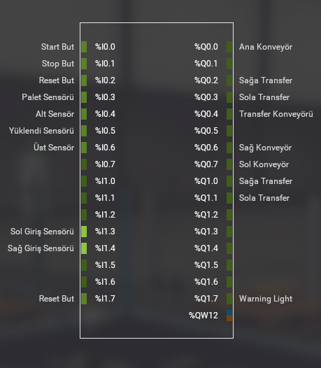

# Automated Dual-Direction Box Sorting & Transfer Line (Siemens S7-1200 | Factory I/O)

[](https://support.industry.siemens.com)
[](https://support.industry.siemens.com)
[](https://factoryio.com)
[-eb780a?style=for-the-badge&logo=siemens&logoColor=white)]()
[-yellowgreen?style=for-the-badge)]()
[](LICENSE)

> **Overview:** Automated dual-direction package sorting and material handling system simulated in **Factory I/O** and controlled by a **Siemens S7-1200 PLC** programmed in **TIA Portal** using Ladder Logic (LAD). The system features optical height classification, automated queue buffering, and jam protection.

---

## Table of Contents
1. [System Overview & Layout](#1-system-overview--layout)
2. [I/O Tag Mapping](#2-io-tag-mapping)
3. [System Flowchart](#3-system-flowchart)
4. [Ladder Logic (LAD) Breakdown](#4-ladder-logic-lad-breakdown)
5. [Safety & Jam Protection](#5-safety--jam-protection)
6. [Setup & Virtual Commissioning Guide](#6-setup--virtual-commissioning-guide)
7. [Repository File Structure](#7-repository-file-structure)
8. [License & Attribution](#8-license--attribution)

---

## 1. System Overview & Layout

The system automatically sorts packages according to their height without requiring vision cameras. Two optical sensors inspect incoming boxes on the main conveyor and route them to their designated takeaway lines:
- **Short Boxes:** Diverted to the **Right Conveyor**
- **Tall Boxes:** Diverted to the **Left Conveyor**

```
                                 +-------------------------+
                                 |  Left Exit Conveyor     |
                                 |  (%Q0.7)                |
                                 +------------^------------+
                                              | Sola Transfer (%Q0.3, %Q1.1)
                                              | Sol Giriş Sensörü (%I1.3)
+----------------+       +---------------+    |    +-------------------------+
| Main Infeed    | ----> | Height Check  | -> + -> | Transfer Bed (%Q0.4)    |
| Conveyor (%Q0.0)|      | (%I0.4, %I0.6)|    |    +-------------------------+
+----------------+       +---------------+    | Sağa Transfer (%Q0.2, %Q1.0)
   Palet Sensörü            Yüklendi          | Sağ Giriş Sensörü (%I1.4)
   (%I0.3)                  Sensörü (%I0.5)   v
                                 +-------------------------+
                                 |  Right Exit Conveyor    |
                                 |  (%Q0.6)                |
                                 +-------------------------+
```

### Main Functional Areas

1. **Main Infeed Conveyor (`%Q0.0`):** Transports arriving packages into the sorting cell. If boxes start to pile up at the entry, the queue sensor (`%I0.3 Palet Sensörü`) temporarily pauses the feed conveyor to prevent jams.
2. **Height Inspection Station:** Uses two photoelectric beam sensors:
   - **`%I0.4 Alt Sensör`:** Detects box presence at the sorting entry.
   - **`%I0.6 Üst Sensör`:** Detects if the box is tall.
   - **`%I0.5 Yüklendi Sensörü`:** Confirms the box has fully moved onto the transfer bed.
3. **Bi-Directional Transfer Station (`%Q0.4`, `%Q1.0`, `%Q1.1`):** A center motorized roller table (`%Q0.4`) centers the box, and directional diverters (`%Q1.0` Right / `%Q1.1` Left) push the box to the correct outfeed lane.
4. **Exit Conveyors (`%Q0.6`, `%Q0.7`):** Carry the sorted boxes to downstream stations. Optical sensors (`%I1.3 Sol Giriş` and `%I1.4 Sağ Giriş`) confirm the box has safely cleared the transfer zone.

---

## 2. I/O Tag Mapping

Direct mapping between Factory I/O virtual devices and the Siemens S7-1200 PLC.

### Digital Inputs (DI)
| Address | Tag Name | Type | Description |
| :--- | :--- | :--- | :--- |
| `%I0.0` | `Start But` | Button | System Start pushbutton |
| `%I0.1` | `Stop But` | Button | System Stop pushbutton |
| `%I0.2` | `Reset But` | Button | Fault / Alarm Reset pushbutton |
| `%I0.3` | `Palet Sensörü` | Sensor | Infeed queue tracking & jam detection sensor |
| `%I0.4` | `Alt Sensör` | Sensor | Low-height optical baseline sensor |
| `%I0.5` | `Yüklendi Sensörü` | Sensor | Transfer table entry / box arrival sensor |
| `%I0.6` | `Üst Sensör` | Sensor | High-height optical inspection sensor |
| `%I1.3` | `Sol Giriş Sensörü`| Sensor | Left exit conveyor clearance sensor |
| `%I1.4` | `Sağ Giriş Sensörü`| Sensor | Right exit conveyor clearance sensor |
| `%I1.7` | `Reset But` | Button | Secondary station reset pushbutton |

### Digital Outputs (DQ)
| Address | Tag Name | Type | Description |
| :--- | :--- | :--- | :--- |
| `%Q0.0` | `Ana Konveyör` | Conveyor | Main infeed feed conveyor |
| `%Q0.2` | `Sağa Transfer` | Motor | Auxiliary right transfer motor |
| `%Q0.3` | `Sola Transfer` | Motor | Auxiliary left transfer motor |
| `%Q0.4` | `Transfer Konveyörü`| Conveyor | Center transfer table roller drive |
| `%Q0.6` | `Sağ Konveyör` | Conveyor | Right exit takeaway conveyor |
| `%Q0.7` | `Sol Konveyör` | Conveyor | Left exit takeaway conveyor |
| `%Q1.0` | `Sağa Transfer` | Diverter | Right transfer diverter unit |
| `%Q1.1` | `Sola Transfer` | Diverter | Left transfer diverter unit |
| `%Q1.7` | `Warning Light` | Light | Alarm / Warning beacon light |

### Internal Memory Bits & Flags (M)
| Address | Tag Name | Data Type | Function |
| :--- | :--- | :--- | :--- |
| `%M0.0` | `Start_mem` | BOOL | Main system run memory latch (SR latch) |
| `%M1.0` | `motor_stop` | BOOL | Queue buffer stop flag (pauses `%Q0.0`) |
| `%M1.1` | `transfer_motor_mem` | BOOL | Transfer conveyor run memory flag |
| `%M2.0` | `right_transfer_mem` | BOOL | Right transfer active memory flag (Short Box) |
| `%M2.1` | `left_transfer_mem` | BOOL | Left transfer active memory flag (Tall Box) |
| `%M2.2` | `left_transfer_stop_mem` | BOOL | Left transfer completion flag |
| `%M2.3` | `right_transfer_stop_mem`| BOOL | Right transfer completion flag |
| `%M10.5`| `Emergency_stop` | BOOL | Latched jam / emergency stop state |

### IEC Timers
| Timer DB | Tag Name | Type | Duration | Purpose |
| :--- | :--- | :--- | :--- | :--- |
| `%DB1` | `timer1` | TON | `1.0s` | Infeed queue hold delay (sets `%M1.0` to pause feeder) |
| `%DB2` | `timer10` | TON | `1.4s` | Clearance confirmation delay (resets `%M1.0` to restart feeder) |
| `%DB3` | `timer3` | TOF | `2.0s` | Transfer bed run-on timer (ensures box reaches table center) |
| `%DB6` | `timer6` | TON | `1.5s` | Right transfer alignment delay before pusher fires |
| `%DB4` | `timer7` | TON | `3.0s` | Right transfer pusher active run duration |
| `%DB7` | `timer8` | TON | `1.5s` | Left transfer alignment delay before pusher fires |
| `%DB8` | `timer9` | TON | `3.0s` | Left transfer pusher active run duration |

---

## 3. System Flowchart



---

## 4. Ladder Logic (LAD) Breakdown

The PLC logic is implemented in **Siemens TIA Portal Main [OB1]**. Below is the network-by-network breakdown matching the project rungs:

---

### Network 2: Start_Stop_Button
- **Function:** Master system start/stop latch.
- **Logic:**
  - Pressing `%I0.0 Start But` pulses positive edge input `S` on the `SR` flip-flop, setting `%M0.0 Start_mem`.
  - Pressing `%I0.1 Stop But` or triggering `%M10.5 Emergency_stop` activates reset input `R1`, stopping the line.
- **Ladder Rung:**



---

### Network 3: Motor_Stop
- **Function:** Intelligent infeed queue buffering to prevent box pile-ups.
- **Logic:**
  - When `%I0.3 Palet Sensörü` stays blocked for **1.0 second** (TON `%DB1 timer1`), the program sets `%M1.0 motor_stop`, pausing the main infeed conveyor (`%Q0.0`).
  - Once the box clears the transfer zone and triggers either `%I1.4 Sağ Giriş Sensörü` or `%I1.3 Sol Giriş Sensörü` for **1.4 seconds** (TON `%DB2 timer10`), `%M1.0 motor_stop` resets, and infeed resumes automatically.
- **Ladder Rung:**



---

### Network 4: Warning_Lamb_And_Emergency_Stop
- **Function:** Conveyor jam detection and visual alarm signaling.
- **Logic:**
  - If `%I0.3 Palet Sensörü` and `%I0.5 Yüklendi Sensörü` are **both active at the same time**, it indicates a box jam at the transfer entry.
  - The logic sets `%M10.5 Emergency_stop` and turns on the warning stack light **`%Q1.7 Warning Light`**, stopping the drives.
  - The alarm remains latched until the physical jam is cleared and `%I0.2` or `%I1.7 Reset But` is pressed.
- **Ladder Rung:**



---

### Network 5: Main_Motors_Control
- **Function:** Controls the primary feed and takeaway exit conveyors.
- **Logic:**
  - Left and Right takeaway conveyors (`%Q0.6`, `%Q0.7`) run while `%M0.0 Start_mem` is active.
  - Main infeed conveyor (`%Q0.0`) runs with `%M0.0`, but is gated through a normally-closed contact of `%M1.0 motor_stop`. When queue buffering is triggered, `%Q0.0` stops immediately while the exit conveyors continue discharging boxes.
- **Ladder Rung:**



---

### Network 6: Transfer_Control
- **Function:** Center roller table drive and optical height classification.
- **Logic:**
  - When `%I0.3` detects a box, it feeds TOF timer `%DB3 timer3` (`T#2s`), keeping transfer rollers `%Q0.4` running for 2 seconds to center the box on the table.
  - **Short Box:** `%I0.4 Alt Sensör` = TRUE AND `%I0.6 Üst Sensör` = FALSE $\rightarrow$ Sets `%M2.0 right_transfer_mem`.
  - **Tall Box:** `%I0.4 Alt Sensör` = TRUE AND `%I0.6 Üst Sensör` = TRUE $\rightarrow$ Sets `%M2.1 left_transfer_mem`.
- **Ladder Rung:**



---

### Network 7: Transfer_Control_Set_Reset
- **Function:** Two-stage transfer timing (centering delay $\rightarrow$ lateral diverter push).
- **Logic:**
  - **Right Sort:** `%M2.0` starts a 1.5s delay (TON `%DB6 timer6`) for box alignment. Once timed out, right diverter `%Q1.0` and auxiliary drive `%Q0.2` activate for 3.0s (TON `%DB4 timer7`) to push the box onto the right line, then `%M2.0` is reset.
  - **Left Sort:** `%M2.1` starts a 1.5s delay (TON `%DB7 timer8`). Once timed out, left diverter `%Q1.1` and auxiliary drive `%Q0.3` activate for 3.0s (TON `%DB8 timer9`) to push the box onto the left line, then `%M2.1` is reset.
- **Ladder Rung:**



---

### Network 8: Left_Right_Sensor_mem_Control
- **Function:** Exit confirmation and state clearing.
- **Logic:**
  - Evaluates downstream optical sensors `%I1.3 Sol Giriş Sensörü` and `%I1.4 Sağ Giriş Sensörü`.
  - Confirms the box has cleared the transfer carriage, sets completion flags (`%M2.2`, `%M2.3`), and handshakes with Network 3 to unlatch `%M1.0` so infeed can resume.
- **Ladder Rung:**



---

## 5. Safety & Jam Protection

1. **Simultaneous Jam Interlock:** The concurrent sensor check (`%I0.3` AND `%I0.5`) detects stuck packages and immediately halts motion before boxes get crushed or derailed.
2. **Mutual Exclusion:** Right diverter `%Q1.0` and Left diverter `%Q1.1` cannot be energized simultaneously, preventing mechanical carriage conflicts.
3. **Queue Hysteresis:** The 1.0s / 1.4s timer filtering prevents the infeed motor from rapidly cycling on and off.
4. **Exit Sensor Verification:** The system requires exit confirmation from `%I1.3` / `%I1.4` before calling the transfer cycle complete.

---

## 6. Setup & Virtual Commissioning Guide

### Prerequisites
- **Siemens TIA Portal:** V18 or V19
- **Siemens S7-PLCSIM:** V18 or V19
- **Factory I/O:** v2.5.0 or newer

---

### Step 1: Open TIA Portal Project Archive
1. Open Siemens TIA Portal.
2. Go to **Project** $\rightarrow$ **Retrieve...**
3. Browse to the `plc/` folder of this repo and select `FactoryIO_Template_S7-1200_V15_V18_2.zap18` (or `automated_box_sorting_v18.zap18`).
4. Select a destination folder and click **OK**.
5. In the Project tree, expand `PLC_1 [CPU 1214C DC/DC/DC]` $\rightarrow$ `Program blocks` $\rightarrow$ `Main [OB1]`.

---

### Step 2: Download & Start S7-PLCSIM
1. In TIA Portal, select `PLC_1` and click **Start Simulation** (`Ctrl + Shift + X`).
2. Set the PG/PC interface to **Siemens PLCSIM Virtual Ethernet Adapter**.
3. Click **Start search**, select the CPU, and click **Load**.
4. In the prompt, set action to **Overwrite all**, click **Load**, and then select **Start module** $\rightarrow$ **Finish**.
5. Verify the simulated CPU LED is solid green (**RUN**).

> **Note:** Ensure CPU Properties $\rightarrow$ *Protection & Security* $\rightarrow$ *Connection mechanisms* has **"Permit access with PUT/GET communication from remote partner"** enabled.

---

### Step 3: Link Factory I/O to S7-PLCSIM
1. Launch **Factory I/O**.
2. Open `factory-io/Counter Uygulama-2.factoryio` (or `box_sorting.factoryio`).
3. In the top bar, click **File** $\rightarrow$ **Drivers** (or press `F4`).
4. Select **Siemens S7-PLCSIM** from the dropdown menu.
5. Click **Configuration**:
   - **Model:** `S7-1200`
   - **Digital Inputs:** Start: `0` | Count: `16`
   - **Digital Outputs:** Start: `0` | Count: `16`
6. Return to Drivers and click **Connect**. A green checkmark confirms the connection.



---

### Step 4: Run the Scene
1. In Factory I/O, click the **Play** button (or press `F5`).
2. On the operator panel, press **Start But (`%I0.0`)**.
3. The main conveyor starts and boxes are classified and diverted automatically based on height.

---

## 7. Repository File Structure

```text
automated-box-sorting-transfer-plc/
├── docs/
│   ├── images/
│   │   ├── network2_Start_Stop_Button.png               # Network 2 LAD Rung Screenshot
│   │   ├── network3_Motor_Stop.png                      # Network 3 LAD Rung Screenshot
│   │   ├── network4_Warning_Lamb_And_Emergency_Stop.png # Network 4 LAD Rung Screenshot
│   │   ├── network5_Main_Motors_Control.png             # Network 5 LAD Rung Screenshot
│   │   ├── network6_Transfer_Control.png                # Network 6 LAD Rung Screenshot
│   │   ├── network7_Transfer_Control_Set_Reset.png      # Network 7 LAD Rung Screenshot
│   │   ├── network8_Left_Right_Sensor_mem_Control.png   # Network 8 LAD Rung Screenshot
│   │   ├── factory_io_drivers.png                       # Factory I/O Driver Configuration
│   │   └── README.md                                    # Screenshot guidelines
│   └── architecture.md                                  # Architectural specifications
├── factory-io/
│   ├── Counter Uygulama-2.factoryio                     # Factory I/O 3D simulation scene
│   └── README.md                                        # Scene notes & configuration guide
├── plc/
│   ├── FactoryIO_Template_S7-1200_V15_V18_2.zap18       # TIA Portal compressed project archive
│   └── README.md                                        # TIA Portal archive guide
├── .gitignore                                           # TIA Portal & OS filter
├── LICENSE                                              # MIT License
├── README.md                                            # Main documentation
├── setup_repo.ps1                                       # PowerShell setup script
└── setup_repo.sh                                        # Bash setup script
```

---

## 8. License & Attribution

Distributed under the **MIT License**. See [LICENSE](LICENSE) for details.

Developed by **Orkun Arda**  
Industrial Automation & Control Systems Engineer  
- GitHub: [@orkunarda](https://github.com/orkunarda)  
- LinkedIn: [linkedin.com/in/orkunarda](https://www.linkedin.com)
