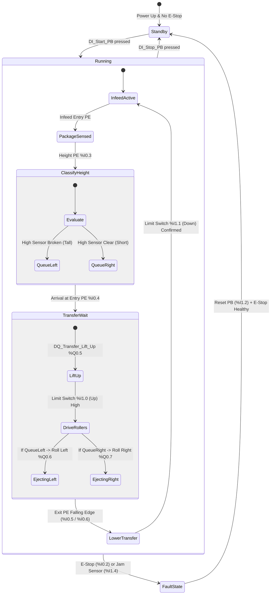

# System Architecture & Engineering Specifications

This document outlines the detailed system architecture, logic sequences, timing considerations, and safety parameters for the **Automated Box Sorting & Bi-Directional Transfer PLC System**.

---

## 1. Process Overview & Functional Areas

The physical cell consists of three primary mechanical sub-assemblies:

```
[Infeed Conveyor] ---> [Inspection & Centering] ---> [Bi-directional Transfer Table]
                                                            |               |
                                                            v               v
                                                    [Left Outfeed]   [Right Outfeed]
```

1. **Infeed Section:**
   - Transports randomly arriving cardboard cartons from upstream packaging cells.
   - Throttles throughput based on downstream transfer availability.

2. **Inspection & Dimension Classification:**
   - A dual optical beam array interrogates carton geometry.
   - The lower baseline sensor detects workpiece presence.
   - The elevated sensor (%I0.3) discriminates carton height (Short: < 200mm, Tall: >= 200mm).

3. **Bi-Directional Transfer & Sorting:**
   - Features a 4-roller motorized pop-up transfer table.
   - Vertical displacement: Pneumatic cylinder with dual reed-switches (%I1.0 Transfer Up, %I1.1 Transfer Down).
   - Bi-directional rollers: Clockwise rotation directs packages to the Left conveyor (%Q0.6); Counter-clockwise rotation directs packages to the Right conveyor (%Q0.7).

4. **Outfeed Lane Clearances:**
   - Two parallel gravity/motorized roller tracks.
   - Monitored by retro-reflective exit photo-eyes (%I0.5 and %I0.6) to confirm complete parcel ejection before the transfer unit drops down to home position.

---

## 2. Sequence State Machine

The control architecture is built as a deterministic finite-state machine (FSM):



---

## 3. Signal Filtering & Debounce Engineering

In high-speed parcel handling, carton flaps, reflective shrink-wrap, and mechanical conveyor vibrations cause high-frequency sensor chatter. To eliminate false triggers:

- **Hardware Debouncing:** All optical sensor inputs are conditioned using a 20ms debounce filter in TIA Portal digital input hardware properties.
- **Software One-Shot Isolation:** Positive edge (`P_TRIG`) detection is enforced on height and arrival sensors. The height classification tag is latched into an internal FIFO bit registers (`%M1.0` and `%M1.1`), insulating downstream logic from subsequent sensor ripples.

---

## 4. Safety Architecture & Interlock Philosophy

Compliant with standard machine safety principles (ISO 13849-1 / IEC 62061 concepts):

- **Fail-Safe E-Stop Circuitry:**
  - The Emergency Stop pushbutton is hardwired as Normally Closed (NC, `%I0.2`).
  - Wire break, physical button depression, or cable disconnection immediately uncouples the master run seal (`%M0.0`).
  - Emergency conditions bypass normal program scan cycles, directly turning off all motor outputs (`%Q0.0` through `%Q0.7`) within < 1 scan cycle (< 5ms).

- **Transfer Table Anti-Collision Interlock:**
  - Pneumatic lift solenoid (`%Q0.5`) cannot energize unless the previous cycle has cleared (`%M0.5 = 0`).
  - Directional transfer motors (`%Q0.6` / `%Q0.7`) are electrically and logically interlocked so that opposite directions can never be commanded concurrently.
  - The infeed conveyor (`%Q0.0`) is halted whenever a carton is actively being raised or transferred, eliminating box pile-ups at the transition boundary.

---

## 5. Factory I/O Driver Configuration Profile

When establishing the virtual link between Siemens S7-PLCSIM and Factory I/O:

```
Driver: Siemens S7-PLCSIM
Model: S7-1200
Network Interface: Siemens PLCSIM Virtual Ethernet Adapter
Digital Inputs Start: 0  | Digital Inputs Count: 16  (Bytes 0..1)
Digital Outputs Start: 0 | Digital Outputs Count: 16 (Bytes 0..1)
```

| Factory I/O Item Name | PLC Address | Type |
| :--- | :--- | :--- |
| Start Button | `%I0.0` | Digital Input |
| Stop Button | `%I0.1` | Digital Input |
| Emergency Stop | `%I0.2` | Digital Input |
| High Sensor | `%I0.3` | Digital Input |
| Transfer Entry Sensor | `%I0.4` | Digital Input |
| Left Exit Sensor | `%I0.5` | Digital Input |
| Right Exit Sensor | `%I0.6` | Digital Input |
| Entry Conveyor | `%Q0.0` | Digital Output |
| Left Exit Conveyor | `%Q0.1` | Digital Output |
| Right Exit Conveyor | `%Q0.2` | Digital Output |
| Pop-up Transfer Lift | `%Q0.5` | Digital Output |
| Pop-up Rollers Left | `%Q0.6` | Digital Output |
| Pop-up Rollers Right | `%Q0.7` | Digital Output |
| Warning Light Red | `%Q1.0` | Digital Output |
| Warning Light Green | `%Q1.1` | Digital Output |
| Warning Light Amber | `%Q1.2` | Digital Output |
| Warning Siren | `%Q1.3` | Digital Output |
